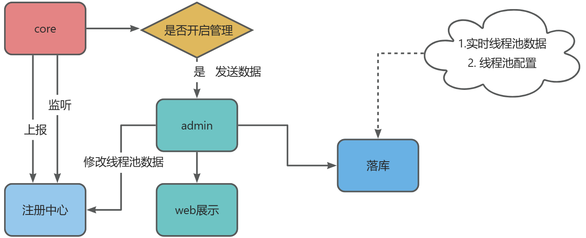

## 线程池痛点
线程池是一种基于池化思想管理线程的工具，使用线程池可以减少创建销毁线程的开销，避免线程过多导致系统资源耗尽。在高并发以及大批量的任务处理场景，线程池的使用是必不可少的。
如果有在项目中实际使用线程池，相信你可能会遇到以下痛点：
- 线程池随便定义，线程资源过多，造成服务器高负载。 
- 线程池参数不易评估，随着业务的并发提升，业务面临出现故障的风险。 
- 线程池任务执行时间超过平均执行周期，开发人员无法感知。 
- 线程池任务堆积，触发拒绝策略，影响既有业务正常运行。 
- 当业务出现超时、熔断等问题时，因为没有监控，无法确定是不是线程池引起。
- 无法执行优雅关闭，当项目关闭时，大量正在运行的线程池任务被丢弃。 
- 线程池运行中，任务执行停止，怀疑发生死锁或执行耗时操作，但是无从下手。

## 什么是poolify
poolify是一款轻量级的动态线程池框架，目前支持的注册中心有： nacos。
提供一下功能：
- 全局管控 - 管理应用线程池实例。 
- 动态变更 - 应用运行时动态变更线程池参数
- 数据采集 - 使用mysql和定时任务方式，实时采集线程池参数
- 运行监控 - 实时查看线程池运行时数据，自定义时间内线程池运行数据图表展示。

### 架构


### 功能


### poolify模块介绍
```lua
poolify -------------------------------------父项目，公共依赖
    ├── poolify-admin ------------------------------- 管理模块（提供web管理服务）
    ├── poolify-admin-test ------------------------------- 管理模块测试
    ├── poolify-common ------------------------------- 公共模块模块
    ├── poolify-core ------------------------------- 核心模块（提供注解管理线程池，定时上报线程池数据，监听注册中心等）
    └── poolify-core-test ---------------------------------- 核心模块测试
```

### 使用教程
1. 在项目中引入poolify-core模块
```
<dependency>
   <groupId>cn.poolify</groupId>
   <artifactId>poolify-core</artifactId>
   <version>1.0.3</version>
</dependency>
```
2. 编写application文件
```yml
spring:
  name: poolify # 必填
poolify:
  management: # 选填
    enabled: true  # 是否开启管理端，默认为true，可设置false关闭
    addr: localhost:8091 # 管理端地址
    collection-cron: "0/10 * * * * ?" # 上报定时任务cron
  registry:
    type: nacos # 必填，目前只支持nacos为注册中心
    nacos:
      host: localhost # 指定nacos地址
      port: 8848 # 指定nacos端口号
```

### 页面
todo